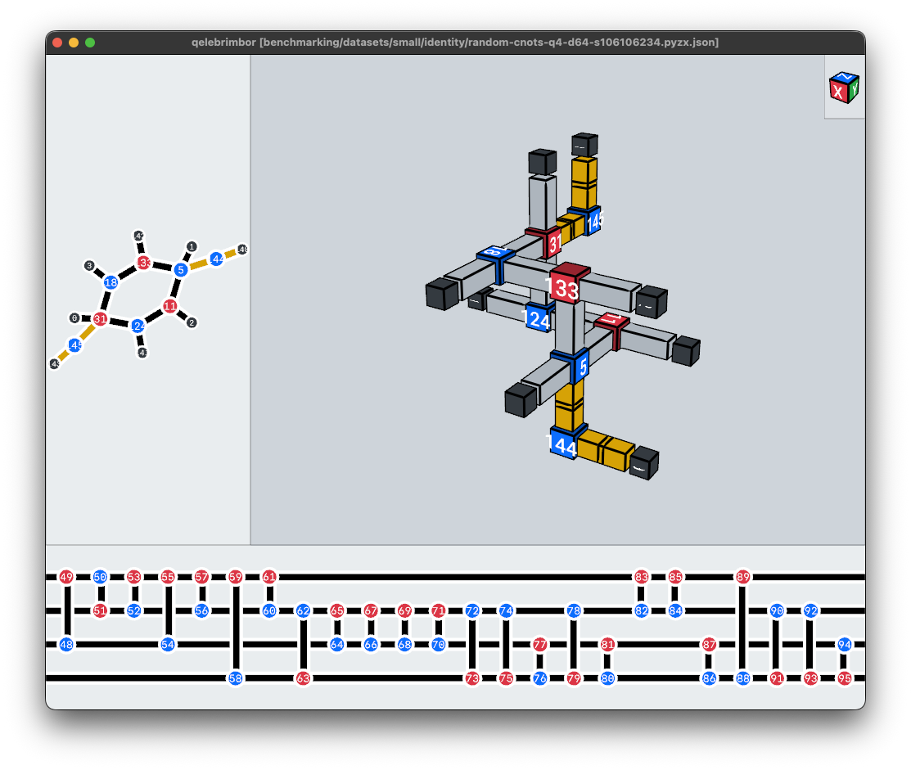

**_NOTE:_** *This project is under active development and provides no backwards compatibility.*

---

# qelebrimbor

A toolbox for studying the relationships between ZX-graphs and Lattice Surgery. A utility to help convert the former into the latter.

## Installation
```bash
# Clone the repository to your preferred location. 
$ git clone https://github.com/doczenwiry/qelebrimbor.git
$ cd qelebrimbor

# Sync environment using uv.
$ uv sync --compile-bytecode

# Run the main script to conclude/test the installation (n.b. first execution is slower)
$ uv run qb.py -h
```

## Terminology
- Input ZX-graph: the input ZX-graph that is provided in the input *.json file to qelebrimbor.
- Internal ZX-graph: the input ZX-graph undergoes a full-reduction by PyZX prior to the inflation process
- Output ZX-graph: the result of the inflation process can be thought of as equivalent to the internal ZX-graph with additional spiders/legs introduced to account for the spacetime considerations.
- Portless node: a portless node is a node that is realised by at least one cube, has an unrealised edge and none of its realising cubes has any open ports.
  - This represents a situation where the output ZX-graph cannot be completed

## Benchmarking script
In order to benchmark the tool against a fixed dataset of small circuits, run the following command
```bash
$ uv run benchmarking/benchmark-dataset-rings-small.py
```

The results of the benchmarking execution are stored in a *.csv file under the benchmarking/results directory and marked with the commit hash.

The current dataset contains circuits working with 4 qubits with depth ranging from 4 through 1024 layers and only contains CNOT gates (cfr. directory benchmarking/datasets/small/identity).
Note that due to current assumptions for the inflation process, the benchmarking tool only considers the circuits which have a single connected component and whose internal ZX-graph contains at least one cycle.

Each file is processed by qb.py and the result is summarized in a single line as follows:
```bash
> random-cnots-q4-d4-s2712719750.pyzx.json    : RUN: 0.273s, INRR: 100.00%, IERR: 100.00%, PNR:   0.00%, IIR: +25.00%, RIR: +37.50%, AIR: -37.50%, SC:  16, ISC:   8, TV:  10, EQUIVALENCE-ICWAI:SUCCESS
```
The meaning of the various fields is as follows:
- RUN: the Runtime needed to perform the inflation stage on the internal ZX-graph
- INRR: the Node Realisation Rate for the internal ZX-graph
- IERR: the Edge Realisation Rate for the internal ZX-graph
- PNR: the Portless Nodes Rate in the output ZX-graph
- IIR: the Internal Inflation Rate describes how many extra spiders have been added in the process of constructing the output ZX-graph w.r.t. the internal ZX-graph
- RIR: the Required Inflation Rate provides a guesstimate of how many extra spiders will be needed in the process of inflating the internal ZX-graph
  - This figure is not an exact value but more a guideline for the development process
- AIR: the Achieved Inflation Rate describes how many extra spiders have been added in the process of constructing the volumetric ZX-graph w.r.t. the input ZX-graph
- SC: the Spider Count provides the number of spiders present in the input ZX-graph
- ISC: the Internal Spider Count provides the number of spiders present in the internal ZX-graph
- TV: the Total Volume gives the number of X/Z nodes present in the output ZX-graph
- EQUIVALENCE-ICWAI: reports whether the input ZX-graph and the output ZX-graph are equivalent
  - the ICWAI method tests whether the composition of the input with the adjoint of the output is the identity operator
- EQUIVALENCE-CT: if the ICWAI methods failed and the input has at most 8 qubits, the equivalence is checked by converting the input and output to tensors and comparing them

**Note: currently, the benchmark can report two alternative outcomes**

- FAILURE [Trees] : Realisation of O:N3 failed: X:N9:#52 has no ports available.
  - This means that the inflation process of the internal ZX-graph has failed when inflating the trees due to a portless node.
- ABORTED RUN [longer than 10 seconds].
  - In order to avoid wasting time on internal ZX-graphs that are too complicated (i.e. the heaviest cycle is too long), the benchmark aborts a run if it takes more than 10 seconds.

The arguments accepted by the benchmarking tool can be obtained by running

```bash
$ uv run benchmarking/benchmark-dataset-rings-small.py -h
```

## Main script

It is possible to invoke qb.py directly to perform the construction of a specific circuit from the dataset. 
```bash
$ uv run qb.py -zv benchmarking/datasets/small/identity/random-cnots-q4-d64-s106106234.pyzx.json
ANALYSIS STAGE.
> Input file : benchmarking/datasets/small/identity/random-cnots-q4-d64-s106106234.pyzx.json
> Number of nodes : 144 [O:8,X:64,Z:72]
> Number of edges : 204 [IDENTITY:204]
> Number of qubits : 4
> Number of layers : 68
> Completed in 0.00 seconds.

PREPROCESSING STAGE.
> Applying preprocessor : FullReduce
> Number of nodes : 16 [O:8,X:3,Z:5]
> Number of edges : 16 [IDENTITY:12,HADAMARD:4]
> Number of qubits : 4
> Number of layers : 4
> Cycle basis (minimal, computed in 0.0s) has largest cycle of size 6 [count=1]
> Completed in 0.01 seconds.

INFLATION STAGE.
> Phase  I : ZxGraphInflaterRings
>> Ringfinder   : RingfinderColorblindBFS
>> Strandfinder : StrandfinderColorblindFusionDFS
>> Attempting realisation of cycle [L=6] : X:N133 --I-- Z:N18 --I-- X:N31 --I-- Z:N124 --I-- X:N11 --I-- Z:N5 --I-- X:N133
>>> Realised as ring [EV=+0] : #146:N133:XZZ@( 0, 0, 0) --I-- #147:N18:XXZ@( 0,-1, 0) --I-- #148:N31:ZXZ@(-1,-1, 0) --I-- #149:N124:ZXX@(-1,-1,-1) --I-- #150:N11:ZZX@(-1, 0,-1) --I-- #151:N5:XZX@( 0, 0,-1) --I-- #146:N133:XZZ@( 0, 0, 0)
>> Cycles realised : 1/1
>> Runtime : 0.313s
> Phase II : ZxGraphInflaterTrees
>> Attempting realisation of level 0 : [Z:N5:#151, X:N31:#148, X:N11:#150, Z:N18:#147, Z:N124:#149, X:N133:#146]
>> Attempting realisation of level 1 : [Z:N144:#153, Z:N145:#155, O:N1:#152, O:N2:#156, O:N0:#154, O:N3:#157, O:N141:#158, O:N142:#159]
>> Attempting realisation of level 2 : [O:N143:#161, O:N140:#160]
>> Levels realised : 3/3
>> Runtime : 0.001s

REPORTING STAGE.
> Realisation of internal ZX-graph: 
>> Nodes realised : 16/16 [ 100.00%]; O: 100.00%/X: 100.00%/Z: 100.00%
>>> Portless nodes : 0/16 [   0.00%]
>> Edges realised : 16/16 [ 100.00%]; IDENTITY: 100.00%,HADAMARD: 100.00%
>> Total volume   :  8
>> Internal Inflation Rate :    0.00% [required:   0.00%]
> Achieved Inflation Rate :  -94.12%

EQUIVALENCE VALIDATION STAGE.
> Is input equivalent to output [method:iCwAI] ? SUCCESS
```

The reporting performed by the execution of the tool is split into five stages

- Analysis stage: a brief summary of the statistics concerning the input ZX-graph is provided
- Preprocessing stage: the input ZX-graph undergoes a full-reduction by default and the statistics concerning the internal ZX-graph are provided
  - A noteworthy point is the largest cycle detected in the cycle basis as this is the current major bottleneck to the inflation process
- Inflation stage: the construction of the output ZX-graph is performed in two phases
  - Ring phase: the heaviest cycle of the internal ZX-graph is selected and a search is performed to find a minimal ring of cubes realising it
    - The heaviest cycle is the one which has the highest total sum of weight of its constituent edges
      - The weight of an edge is the number of cycles from the minimal cycle basis in which it occurs
    - Once the heaviest cycle has been realised, one of its adjacent cycles is selected to be realised itself
      - The selected cycle is broken down into a realised part and an unrealised part (i.e. a chain) and a search is performed to find a sequence of cubes to realise the latter
  - Tree phase: once all the cycles have been realised, all the remaining nodes belong to trees that are rooted at various nodes of the cycles
    - The construction in this phase is performed level by level across all the trees until all the remaining nodes have been realised
  - Both phases report in more details the cycle/chains/levels that were realised to trace the inflation process
- Reporting stage: various statistics are reported regarding the output ZX-graph that has been constructed
- Equivalence validation stage: in order to guarantee a correct construction, the output ZX-graph is validated against the input ZX-graph
  - iCwAI: whether the composition of the input with the adjoint of the output is the identity operator
  - CT: whether the tensor representations of the input and the output are equal (n.b. only used for circuits with at most 8 qubits)

Furthermore, the following window will appear to visualise the output ZX-graph



## Visualisation

The main script comes with a visualisation window implemented in Vedo.
- The bottom panel displays the input ZX-graph
- The top-left panel displays the internal ZX-graph
- The top-right panel displays the output ZX-graph in the form of a volumetric ZX-graph

By hovering over a node on the internal ZX-graph, the cube realising it will be highlighted in the output ZX-graph.

The following mouse functions are recognised
- Zoom in/out by rotating the mouse scrolling wheel up/down
- Rotate the graph around by pressing and holding the mouse left button

### Color palette

By default, the output ZX-graph is presented using the volumetric ZX-graph palette with the following meaning
- A red (resp. blue) cube represents a XZZ, ZXZ or ZZX (resp. ZXX, XZX or XXZ) cube in the blockgraph notation
- A red (resp. blue) pipe represents an Identity between two red (resp. blue) cubes
- A grey pipe represents an Identity between two cubes of opposite color
- A yellow pipe represents a Hadamard between two cubes

### Cycle highlighting mode

In order to more easily locate the cycles in the output ZX-graph, press the 'c' key to toggle cycle highlighting mode. By default, the heaviest cycle is highlighted. Use the 'Up' and 'Down' keys to highlight another cycle.

### Miscellaneous keyboard shortcuts

- Press 'p' to cycle through the active palette ("Volumetric", "Blockgraph" and "Monochromatic")
- Press 'u' to toggle realised/unrealised highlighting
- Press 'e' to toggle Manhattan Length Excess (a.k.a. overhead) highlighting

### Supported output formats

Currently, qelebrimbor can save the output ZX-graph into various file formats:

- PyZX format in a *.json file (using -p)
- TQEC format in a BLOCKGRAPH (v0.0.1) file (using -t)
- VZX format in a *.vzx file (using -w)

*n.b. the path to the output file will be reported in the terminal*